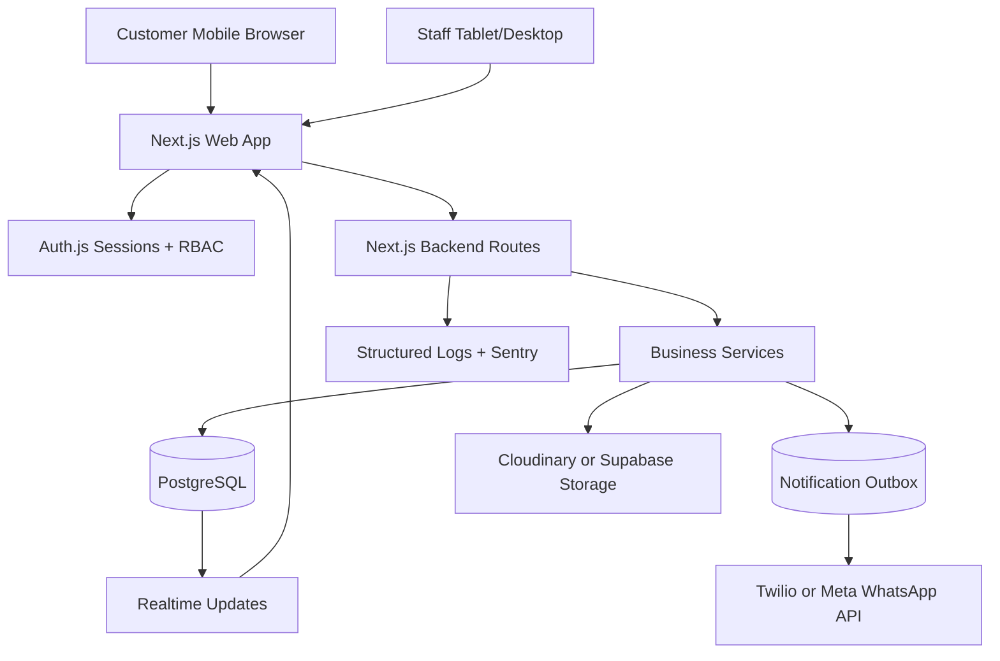
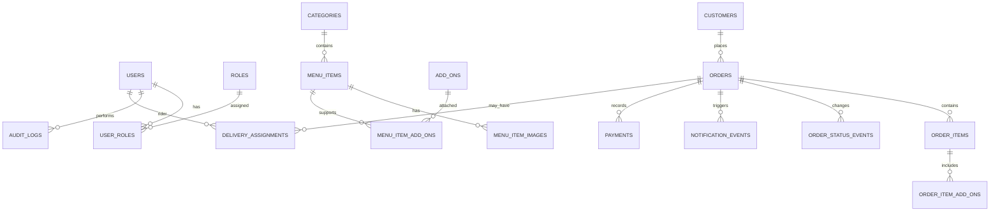
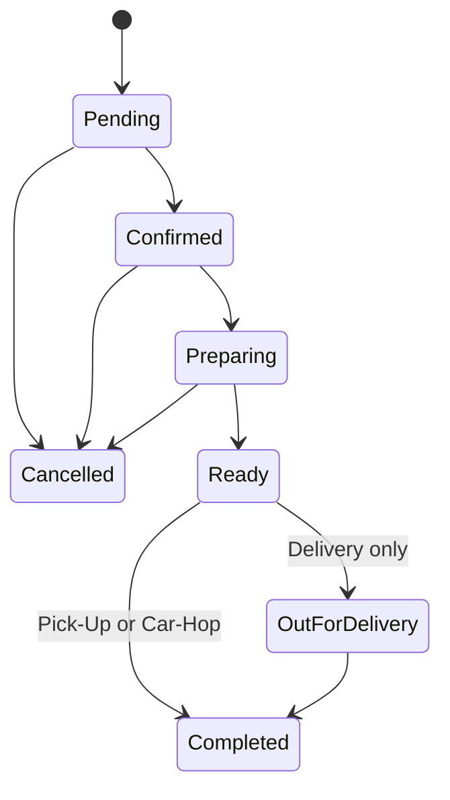

# Flavour Heaven Production Blueprint

## Purpose

This document upgrades the Flavour Heaven ordering idea from a laptop prototype into a production-ready business system for a real cafe/fast food operation in Islamabad. It covers the technical stack, deployment architecture, backend, database, security, role-based screens, image handling, operational workflows, and launch plan.

The system should support:

- Public online ordering for Delivery, Pick-Up, and Car-Hop.
- Mobile-first customer ordering with real food photos provided by Flavour Heaven.
- Staff-only screens for owner, manager, cashier, kitchen, rider, and menu editor roles.
- Secure order processing, durable data storage, daily operations, backups, monitoring, and audit logs.
- A path from simple WhatsApp handoff to official WhatsApp Business API notifications.

## Current Decisions

| Area | Production Decision |
| --- | --- |
| Product type | Web application, not desktop-only software |
| Primary users | Customers, owner, managers, cashiers, kitchen staff, riders, menu editors |
| Frontend | Next.js App Router, React, TypeScript |
| Styling | Tailwind CSS, shadcn/ui, Lucide icons, custom Flavour Heaven theme |
| Backend | Next.js Route Handlers and Server Actions with a separate service layer |
| Database | Managed PostgreSQL, recommended through Supabase or another managed Postgres provider |
| ORM | Prisma for schema, migrations, type safety, and Auth.js adapter support |
| Auth | Auth.js with database sessions, RBAC, secure cookies, optional MFA for senior roles |
| Realtime | Supabase Realtime or server-sent events for order updates |
| Images | Cloudinary for production image optimization, or Supabase Storage if vendor count must stay low |
| WhatsApp | Phase 1: wa.me handoff. Production: Twilio or Meta WhatsApp Business Platform |
| Deployment | Vercel for Next.js plus managed Postgres. Docker option for fixed-server hosting |
| Observability | Sentry, structured logs, uptime monitoring, admin audit logs |
| Brand rule | Yellow/warm neutral brand. Red only for validation, cancelled orders, and critical errors |

## Sources Checked

Current production guidance was checked on 2026-07-17:

- [Next.js App Router docs](https://nextjs.org/docs/app)
- [Next.js deployment docs](https://nextjs.org/docs/app/getting-started/deploying)
- [Next.js authentication guide](https://nextjs.org/docs/app/guides/authentication)
- [Auth.js RBAC guide](https://authjs.dev/guides/role-based-access-control)
- [Supabase Postgres database docs](https://supabase.com/docs/guides/database/overview)
- [Supabase database backups docs](https://supabase.com/docs/guides/platform/backups)
- [Twilio WhatsApp Business Platform docs](https://www.twilio.com/docs/whatsapp/api)
- [OWASP File Upload Cheat Sheet](https://cheatsheetseries.owasp.org/cheatsheets/File_Upload_Cheat_Sheet.html)

## Recommended Production Stack

### Customer And Staff Web App

Use Next.js App Router with TypeScript.

Reasons:

- One codebase can serve the public customer screens and the protected staff dashboard.
- Server Components keep menu/category pages fast.
- Route Handlers and Server Actions are enough for the cafe's first production version.
- The same app can be deployed to Vercel, a Node.js server, or Docker.
- The official Next.js docs list Node.js server and Docker deployment as full-feature deployment options.

Minimum runtime:

- Node.js version should follow the current Next.js requirement. The official docs currently list Node.js 20.9 or newer for App Router projects.
- Use `pnpm` for deterministic installs unless the team prefers `npm`.

Frontend libraries:

- `react`
- `next`
- `typescript`
- `tailwindcss`
- `shadcn/ui`
- `lucide-react`
- `zod`
- `react-hook-form`
- `zustand`
- `@tanstack/react-query` only where client-side data freshness is useful

### Backend Layer

Use Next.js Route Handlers for API endpoints, but keep business logic out of route files.

Suggested backend folder pattern:

```text
src/
  app/
    api/
      public/
      admin/
      webhooks/
  server/
    auth/
    db/
    services/
      order-service.ts
      menu-service.ts
      notification-service.ts
      image-service.ts
      audit-service.ts
    validators/
    policies/
```

Route files should only:

- Authenticate the request.
- Validate input with Zod.
- Call a service.
- Return a typed response.

Services should:

- Run database transactions.
- Enforce business rules.
- Write audit logs.
- Create notification events.
- Hide sensitive fields from logs.

### Database

Use managed PostgreSQL.

Recommended provider for this project:

- Supabase Postgres for managed Postgres, backups, optional Realtime, dashboard access, and a simple upgrade path.

Alternative providers:

- Neon if serverless Postgres and branching are priorities.
- Railway or Render Postgres for simple deployment.
- AWS RDS if the business wants maximum infrastructure control and accepts higher setup complexity.

Why PostgreSQL:

- Orders need ACID transactions.
- Menu, add-ons, categories, users, order items, and audit logs are naturally relational.
- It supports indexes, constraints, enums, JSON fields, and strong migration workflows.

Money storage:

- Store prices as integer minor units, not floating point.
- Example: `price_paisa integer` or `price_pkr integer`.
- If the business only uses whole PKR prices, `price_pkr integer` is acceptable and simpler.

### ORM And Migrations

Use Prisma.

Reasons:

- Clear schema file.
- Strong TypeScript types.
- Migration history for production database changes.
- Good Auth.js adapter support.

Rules:

- Every schema change must be a migration.
- Never edit production schema manually without migration history.
- Run migrations first on staging.
- Production migrations should be deployed during low traffic hours.
- Seed scripts must not overwrite production data.

### Authentication And Authorization

Use Auth.js with database sessions.

Auth.js supports role-based access control patterns where a role is persisted and exposed to the session. For production, store roles in the database and check permissions on the server before every protected operation.

Recommended model:

- A user can have one primary role plus optional granular permissions.
- Server policies decide access, not only UI hiding.
- Managers and owners should have MFA enabled.
- Sessions expire after inactivity.
- Passwords use Argon2id or bcrypt with a strong cost.

Roles:

- `OWNER`
- `MANAGER`
- `CASHIER`
- `KITCHEN`
- `RIDER`
- `MENU_EDITOR`
- `SUPPORT`
- `SYSTEM_ADMIN`

Do not create a shared "admin" password for all staff. Each staff member needs their own login so audit logs are meaningful.

### Realtime Updates

Use Supabase Realtime or SSE.

Recommended:

- Customer tracking: subscribe to order status events by order reference and tracking token.
- Admin order dashboard: subscribe to new order and order status events.
- Kitchen display: subscribe to kitchen queue changes.

Fallback:

- Poll every 10 seconds if realtime is unavailable.

Important:

- Customers must not subscribe to all orders.
- A customer tracking page needs an unguessable `tracking_token`.
- Staff realtime channels must require authenticated staff sessions.

### Image Storage

The business will provide the food photos and logo. The system should not depend on stock photos for production.

Recommended production option:

- Cloudinary for menu images, transformations, WebP/AVIF delivery, responsive sizes, and CDN.

Lower-vendor option:

- Supabase Storage for image files plus Next.js Image for optimization.

Image rules:

- Accept JPEG, PNG, WebP.
- Max upload size: 5 MB for admin upload.
- Re-encode uploaded images.
- Strip metadata.
- Store generated filenames, not the original user filename.
- Store alt text for accessibility.
- Keep the original master image in a private folder/bucket.
- Serve optimized public variants.

Required image crops:

- Menu card: 4:3.
- Item detail hero: 16:9 or 3:2.
- Category tile: 1:1.
- Logo: SVG or high-resolution PNG from the business.

### WhatsApp

Use a phased approach.

Phase 1, fast launch:

- After order creation, show a "Send on WhatsApp" button.
- Button opens `wa.me/923005055377` with a pre-filled order message.
- The database still saves the order before WhatsApp opens.
- Staff can see the order in the dashboard even if the customer does not send the message.

Production phase:

- Use Twilio WhatsApp Business Platform or Meta Cloud API.
- Collect customer opt-in at checkout.
- Use approved templates for business-initiated updates where required.
- Use webhooks for delivery status and inbound replies.
- Verify webhook signatures.
- Retry failed messages through an outbox table.

Important WhatsApp production constraints:

- Business-initiated messages may require approved templates.
- Users must opt in to receive WhatsApp messages.
- Free-form messages are limited by WhatsApp session rules.

### Deployment

Recommended deployment:

- Vercel Pro for Next.js.
- Supabase Pro for Postgres.
- Cloudinary for images.
- Sentry for error tracking.
- UptimeRobot, Better Stack, or equivalent for uptime checks.

Environments:

| Environment | Purpose | Data |
| --- | --- | --- |
| Local | Developer machine | Local or dev database |
| Preview | Every PR or test branch | Preview database or staging database |
| Staging | Final QA before launch | Production-like test data |
| Production | Live cafe system | Real customer and order data |

Production requirements:

- Custom domain, for example `order.flavourheaven.pk`.
- HTTPS everywhere.
- Environment variables stored in platform secret manager.
- No `.env.local` committed.
- Separate production credentials from staging credentials.
- Automatic deploy from protected `main` branch.
- Manual approval for database migrations if the team is small.

Docker option:

- If the business wants a fixed monthly VPS bill, use Docker with a managed Postgres database.
- Next.js can run as a Node.js server or Docker container.
- Put Nginx or a managed load balancer in front.
- Use automated SSL such as Let's Encrypt.

## Production Architecture



## Database Design

### Core Tables



### Tables

#### `users`

Staff users only, not public customer accounts for the first release.

Fields:

- `id`
- `name`
- `email`
- `phone`
- `password_hash`
- `status`: active, suspended
- `last_login_at`
- `created_at`
- `updated_at`

#### `roles`

Fields:

- `id`
- `code`: OWNER, MANAGER, CASHIER, KITCHEN, RIDER, MENU_EDITOR, SUPPORT, SYSTEM_ADMIN
- `name`
- `description`

#### `user_roles`

Fields:

- `user_id`
- `role_id`

#### `audit_logs`

Fields:

- `id`
- `actor_user_id`
- `action`
- `entity_type`
- `entity_id`
- `metadata_json`
- `ip_hash`
- `user_agent`
- `created_at`

Rules:

- Log staff login, logout, failed login, order status changes, price changes, menu edits, role changes, image uploads, settings changes.
- Do not log raw customer phone numbers or full addresses.

#### `categories`

Fields:

- `id`
- `name`
- `slug`
- `description`
- `display_order`
- `is_active`
- `created_at`
- `updated_at`

#### `menu_items`

Fields:

- `id`
- `category_id`
- `name`
- `slug`
- `description`
- `base_price_pkr`
- `is_active`
- `is_featured`
- `is_available`
- `preparation_time_minutes`
- `sort_order`
- `created_at`
- `updated_at`

Rules:

- Inactive items are hidden from customers.
- Unavailable items show as sold out if the manager wants visibility.
- Historical order prices are copied into order item rows.

#### `add_ons`

Fields:

- `id`
- `name`
- `description`
- `price_pkr`
- `is_active`
- `created_at`
- `updated_at`

Examples:

- Extra cheese
- Extra sauce
- Extra meat
- Fries upgrade

#### `menu_item_add_ons`

Fields:

- `menu_item_id`
- `add_on_id`
- `is_default`
- `max_quantity`

#### `image_assets`

Fields:

- `id`
- `provider`
- `provider_public_id`
- `original_filename`
- `safe_filename`
- `mime_type`
- `width`
- `height`
- `size_bytes`
- `alt_text`
- `created_by_user_id`
- `created_at`

#### `menu_item_images`

Fields:

- `menu_item_id`
- `image_asset_id`
- `role`: card, detail, gallery
- `sort_order`

#### `customers`

Guest customer data for orders.

Fields:

- `id`
- `name`
- `phone_e164_enc`
- `phone_e164_hash`
- `created_at`
- `updated_at`

Rules:

- Store encrypted phone for display.
- Store hashed normalized phone for deduplication/search.
- Do not require customer account in first release.

#### `orders`

Fields:

- `id`
- `reference`
- `tracking_token`
- `customer_id`
- `order_type`: DELIVERY, PICK_UP, CAR_HOP
- `status`
- `subtotal_pkr`
- `delivery_fee_pkr`
- `discount_pkr`
- `total_pkr`
- `special_instructions`
- `delivery_address_enc`
- `delivery_area`
- `car_details`
- `payment_method`: CASH, CARD, JAZZCASH, EASYPAISA
- `payment_status`: UNPAID, PENDING, PAID, REFUNDED
- `estimated_ready_at`
- `created_at`
- `updated_at`

Rules:

- `reference` is customer-friendly, for example `FH-240717-1042`.
- `tracking_token` is random and unguessable.
- Delivery address is encrypted.
- Status changes go into `order_status_events`.

#### `order_items`

Fields:

- `id`
- `order_id`
- `menu_item_id`
- `item_name_snapshot`
- `quantity`
- `unit_price_pkr_snapshot`
- `line_total_pkr`
- `instructions`

#### `order_item_add_ons`

Fields:

- `id`
- `order_item_id`
- `add_on_id`
- `add_on_name_snapshot`
- `quantity`
- `unit_price_pkr_snapshot`
- `line_total_pkr`

#### `order_status_events`

Fields:

- `id`
- `order_id`
- `from_status`
- `to_status`
- `changed_by_user_id`
- `note`
- `created_at`

Rules:

- Every status update creates an event.
- Customer tracking reads latest event.
- Audit logs also record staff changes.

#### `notification_events`

Fields:

- `id`
- `order_id`
- `channel`: WHATSAPP, SMS, EMAIL
- `template_code`
- `recipient_hash`
- `payload_json`
- `status`: PENDING, SENT, FAILED, RETRYING
- `provider_message_id`
- `attempt_count`
- `next_attempt_at`
- `last_error`
- `created_at`
- `updated_at`

Rules:

- Use this outbox so order creation does not fail only because WhatsApp is slow.
- Use idempotency keys to avoid duplicate WhatsApp messages.

#### `delivery_zones`

Fields:

- `id`
- `name`
- `area_label`
- `fee_pkr`
- `minimum_order_pkr`
- `estimated_minutes`
- `is_active`

Examples:

- E-11/3
- E-11/2
- F-11
- G-11

#### `delivery_assignments`

Fields:

- `id`
- `order_id`
- `rider_user_id`
- `assigned_by_user_id`
- `picked_up_at`
- `delivered_at`
- `created_at`

#### `settings`

Fields:

- `key`
- `value_json`
- `updated_by_user_id`
- `updated_at`

Examples:

- business hours
- phone numbers
- delivery enabled
- pickup enabled
- car-hop enabled
- maintenance mode
- WhatsApp templates
- tax/service charges

## Backend API Surface

### Public Customer Endpoints

| Endpoint | Method | Purpose |
| --- | --- | --- |
| `/api/public/menu` | GET | Active categories, items, add-ons, images |
| `/api/public/menu/search` | GET | Search visible menu items |
| `/api/public/delivery-zones` | GET | Active delivery areas and fees |
| `/api/public/orders` | POST | Create order |
| `/api/public/orders/:reference` | GET | Tracking view by reference and token |
| `/api/public/orders/:reference/whatsapp-message` | GET | Generate WhatsApp handoff text |

### Staff Endpoints

| Endpoint | Method | Roles |
| --- | --- | --- |
| `/api/admin/orders` | GET | OWNER, MANAGER, CASHIER, KITCHEN |
| `/api/admin/orders/:id` | GET | OWNER, MANAGER, CASHIER, KITCHEN, RIDER if assigned |
| `/api/admin/orders/:id/status` | PATCH | OWNER, MANAGER, CASHIER, KITCHEN, RIDER limited |
| `/api/admin/orders/:id/assign-rider` | POST | OWNER, MANAGER, CASHIER |
| `/api/admin/menu/items` | CRUD | OWNER, MANAGER, MENU_EDITOR |
| `/api/admin/menu/categories` | CRUD | OWNER, MANAGER, MENU_EDITOR |
| `/api/admin/menu/add-ons` | CRUD | OWNER, MANAGER, MENU_EDITOR |
| `/api/admin/images` | POST | OWNER, MANAGER, MENU_EDITOR |
| `/api/admin/users` | CRUD | OWNER, SYSTEM_ADMIN |
| `/api/admin/roles` | GET/PATCH | OWNER, SYSTEM_ADMIN |
| `/api/admin/reports/*` | GET | OWNER, MANAGER |
| `/api/admin/audit-logs` | GET | OWNER, SYSTEM_ADMIN |
| `/api/admin/settings` | GET/PATCH | OWNER, MANAGER |

### Webhook Endpoints

| Endpoint | Method | Purpose |
| --- | --- | --- |
| `/api/webhooks/twilio/whatsapp` | POST | Inbound WhatsApp replies and delivery status |
| `/api/webhooks/cloudinary` | POST | Optional image processing callback |
| `/api/cron/notification-retry` | POST | Retry failed notifications |
| `/api/cron/daily-summary` | POST | Daily sales/order summary |

Webhook rules:

- Verify provider signature.
- Make handlers idempotent.
- Do not trust inbound payloads without validation.
- Store raw webhook body only if it does not include sensitive customer data, or redact before storing.

## Order Lifecycle



Status meanings:

| Status | Meaning | Who Can Set |
| --- | --- | --- |
| Pending | Order was placed, staff has not accepted it yet | System |
| Confirmed | Staff accepted the order | Cashier, Manager |
| Preparing | Kitchen started making food | Kitchen, Manager |
| Ready | Food is ready for pickup/rider/car-hop | Kitchen, Cashier, Manager |
| Out_For_Delivery | Rider picked up delivery order | Rider, Cashier, Manager |
| Completed | Order fulfilled | Cashier, Rider, Manager |
| Cancelled | Order cancelled | Manager, Owner, Cashier with reason |

Cancellation must require a reason.

## Role-Based Access Control

### Permission Matrix

| Capability | Owner | Manager | Cashier | Kitchen | Rider | Menu Editor | Support | System Admin |
| --- | --- | --- | --- | --- | --- | --- | --- | --- |
| View live orders | Yes | Yes | Yes | Kitchen queue only | Assigned only | No | Read-only | Yes |
| Create phone/manual order | Yes | Yes | Yes | No | No | No | No | No |
| Update order status | Yes | Yes | Yes | Kitchen statuses | Delivery statuses | No | No | Yes |
| Cancel order | Yes | Yes | Limited | No | No | No | No | Yes |
| Assign rider | Yes | Yes | Yes | No | No | No | No | Yes |
| Edit menu items | Yes | Yes | No | No | No | Yes | No | Yes |
| Edit prices | Yes | Yes | No | No | No | Optional | No | Yes |
| Upload food images | Yes | Yes | No | No | No | Yes | No | Yes |
| Manage categories/add-ons | Yes | Yes | No | No | No | Yes | No | Yes |
| View sales reports | Yes | Yes | No | No | No | No | No | Optional |
| Manage staff | Yes | No | No | No | No | No | No | Yes |
| View audit logs | Yes | No | No | No | No | No | No | Yes |
| Change system settings | Yes | Limited | No | No | No | No | No | Yes |

### Server-Side Policy Examples

- `canViewOrder(user, order)`
- `canUpdateOrderStatus(user, order, nextStatus)`
- `canEditMenu(user)`
- `canManageStaff(user)`
- `canViewReports(user)`
- `canUploadImage(user)`

Every protected action must call a policy function. UI permissions are helpful, but server policies are the real protection.

## Security Plan

### Transport Security

- HTTPS only.
- TLS 1.2 or newer.
- HSTS enabled after domain is stable.
- Secure cookies in production.
- No mixed-content image URLs.

### Admin Login Security

- Individual staff accounts.
- Argon2id preferred; bcrypt with strong cost is acceptable.
- Secure, HttpOnly, SameSite cookies.
- Session idle timeout: 8 hours for staff.
- Shorter timeout for owner/system admin if desired.
- Force logout on password change.
- Rate limit login attempts by IP and username.
- Alert owner on repeated failed logins.
- MFA for owner and system admin.

### Authorization

- Server-side RBAC on every staff endpoint.
- No direct object access without ownership/role checks.
- Riders can only see assigned delivery orders.
- Kitchen cannot see full customer address unless needed.
- Support role should see masked phone/address by default.

### Customer Data Protection

Sensitive data:

- Phone numbers.
- Delivery addresses.
- Customer names.
- Order notes that may include personal details.

Protection:

- Encrypt phone and address fields at rest.
- Store normalized phone hash for lookup without exposing phone.
- Redact raw phone/address from logs.
- Limit access by role.
- Use database backups with restricted access.
- Define retention period for customer data.

Recommended retention:

- Orders: 24 months for business reporting unless legal/tax needs differ.
- Raw addresses: 6 to 12 months, then mask or delete if no longer needed.
- Audit logs: 24 months.

### Input Validation

Use Zod schemas for:

- Customer order creation.
- Phone normalization.
- Address length limits.
- Special instructions max 500 characters.
- Menu item names/prices.
- Add-on prices.
- Status transitions.
- Image metadata.

Rules:

- Never trust client totals. Recalculate price on the server.
- Never trust item price from the cart. Load current menu price during order creation.
- Copy price snapshots into order rows.
- Reject invalid status transitions.
- Sanitize output and avoid rendering raw HTML from user input.

### File Upload Security

Follow OWASP file upload guidance:

- Allowlist extensions: `.jpg`, `.jpeg`, `.png`, `.webp`.
- Check MIME type and file signature.
- Limit size.
- Generate new filenames.
- Re-encode images.
- Strip metadata.
- Store files outside the app server filesystem.
- Only authorized staff can upload.
- Use a CDN URL for public optimized variants.

### API Rate Limits

Suggested starting limits:

| Area | Limit |
| --- | --- |
| Public menu | 300 requests/min/IP |
| Create order | 10 requests/min/IP and 5 requests/10 min/phone |
| Tracking page | 60 requests/min/IP |
| Login | 5 attempts/10 min/username and IP |
| Image upload | 20 uploads/hour/staff user |
| Admin APIs | 120 requests/min/staff user |

When exceeded:

- Return HTTP 429.
- Log a security event.
- Do not reveal whether a username exists.

### Webhook Security

- Verify Twilio/Meta signatures.
- Use idempotency keys.
- Reject stale timestamps if provider supports them.
- Log failed verification without storing sensitive payloads.

### Secrets

Store only in the platform secret manager:

- Database URL.
- Auth secret.
- Twilio credentials.
- Cloudinary credentials.
- Encryption keys.
- Sentry DSN if private.

Never store secrets:

- In Git.
- In screenshots.
- In frontend `NEXT_PUBLIC_*` variables unless intended to be public.

### Audit Log Events

Audit these actions:

- Staff login/logout.
- Failed login.
- Password reset/change.
- Role change.
- Menu item create/update/inactivate.
- Price change.
- Image upload/delete.
- Order status update.
- Order cancellation.
- Rider assignment.
- Business settings change.
- Export/download of reports.

## Backup And Disaster Recovery

Minimum:

- Daily managed database backups.
- Weekly manual export kept off-platform.
- Restore test once per month.
- Image storage backup/export plan.

Recommended:

- Supabase Pro daily backups at minimum.
- Point-in-time recovery once order volume becomes meaningful.
- Separate storage backup because database backups do not restore deleted storage objects in many managed platforms.

Targets:

| Target | Recommendation |
| --- | --- |
| RPO | 24 hours minimum, 1 hour or less after PITR |
| RTO | 4 hours minimum, 1 hour for mature production |
| Backup time | 03:00 PKT |
| Restore test | Monthly |

Operational rule:

- A backup plan is not complete until a restore has been tested.

## Monitoring And Operations

### Required Monitoring

- Uptime check for customer homepage.
- Uptime check for order creation health endpoint.
- Sentry for frontend/backend exceptions.
- Database CPU/storage/connection alerts.
- Failed notification queue alerts.
- Failed login spike alerts.
- Slow API endpoint alerts.

### Health Endpoints

- `/api/health`: app alive.
- `/api/health/db`: database connectivity, protected or internal.
- `/api/health/queue`: notification queue status, protected or internal.

### Daily Business Summary

Send owner/manager a daily summary:

- Total orders.
- Total sales.
- Delivery vs Pick-Up vs Car-Hop.
- Cancelled orders.
- Top menu items.
- Out-of-stock items.
- Average preparation time.
- Failed WhatsApp notifications.

## Screen Design Blueprint

### Design Rules

- Mobile-first for customers.
- Tablet/desktop-first for admin and kitchen.
- Yellow, white, warm neutral, and brown brand palette.
- Red only for errors, cancelled orders, destructive confirmation, and validation.
- Real food images from Flavour Heaven should be the first visual signal.
- No decorative stock-food look once real photos are provided.
- Use Lucide icons for actions.
- Keep cards compact with 8px radius unless the final design system says otherwise.
- Do not make the first screen a marketing landing page. The first screen should help hungry customers start an order.

### Customer Screens

#### 1. Start Order Screen

Primary goal:

- Let the customer choose Delivery, Pick-Up, or Car-Hop immediately.

Layout:

- Header with Flavour Heaven logo, Open 24/7, call button.
- Food photo hero using real cafe image.
- Three order type buttons/cards with icons.
- If Delivery selected, open delivery location panel.
- Sticky cart button appears after item is added.

Key states:

- Open 24/7 active state.
- Temporary closed/maintenance state.
- Delivery disabled state.
- Network retry state.

#### 2. Delivery Location Screen

Primary goal:

- Capture enough address information for delivery.

Fields:

- Name.
- WhatsApp phone.
- Delivery area dropdown.
- Full address.
- Nearest landmark.
- Optional current location button if maps integration is added.

Validation:

- Required phone.
- Required delivery area.
- Required address.
- Reject unsupported area with helpful message.

#### 3. Menu Browser Screen

Primary goal:

- Let customers browse and add food quickly.

Layout:

- Sticky top category tabs.
- Search field.
- Featured items row.
- Menu item grid/list.
- Item image, name, short description, price, availability, add button.
- Mobile sticky cart summary.

States:

- Loading skeleton.
- Empty category.
- Sold out item.
- Menu updated refresh state.

#### 4. Item Detail And Customization Screen

Primary goal:

- Choose add-ons, quantity, and item instructions.

Layout:

- Large item image.
- Name, description, price.
- Add-on groups.
- Quantity stepper.
- Special instruction for that item.
- Add to order button with calculated price.

Rules:

- Price is recalculated server-side later.
- Add-on quantity limits must be enforced in UI and backend.

#### 5. Cart Drawer/Cart Screen

Primary goal:

- Review selected items before checkout.

Layout:

- Items with quantity steppers.
- Add-ons under each item.
- Edit/remove actions.
- Subtotal.
- Delivery fee if applicable.
- Total.
- Checkout button.

States:

- Empty cart.
- Price changed warning.
- Item became unavailable warning.

#### 6. Checkout Details Screen

Primary goal:

- Capture customer details and fulfillment details.

Fields:

- Name.
- WhatsApp phone.
- Order type.
- Delivery address or car details where needed.
- Special instructions.
- Payment method, starting with Cash.

Checkbox:

- WhatsApp update opt-in for production messaging.

#### 7. Review And Confirm Screen

Primary goal:

- Final confirmation before order creation.

Layout:

- Itemized order.
- Order type.
- Customer contact.
- Address/car details if applicable.
- Total.
- Confirm button.

Rules:

- Server creates the order only after confirm.
- On failure, preserve cart.

#### 8. Order Success Screen

Primary goal:

- Give order reference and next action.

Layout:

- Order reference.
- Status: Pending.
- Estimated time.
- WhatsApp button.
- Track order button.
- Call restaurant button.

Production WhatsApp:

- If official API is active and customer opted in, show "WhatsApp updates enabled".
- If not active, show "Send order on WhatsApp" handoff button.

#### 9. Order Tracking Screen

Primary goal:

- Show live order progress.

Layout:

- Order reference.
- Timeline.
- Estimated ready/delivery time.
- Items summary.
- Contact restaurant button.

Timeline variants:

- Delivery: Pending, Confirmed, Preparing, Ready, Out for Delivery, Completed.
- Pick-Up/Car-Hop: Pending, Confirmed, Preparing, Ready, Completed.

#### 10. Business Info Screen

Primary goal:

- Provide address, phone numbers, map link, hours, and basic policies.

Content:

- Flavour Heaven.
- Aksan Center Street #51, E-11/3 Markaz, Islamabad, Pakistan.
- (051) 2751857.
- 0300-5055377.
- Open 24/7.
- Delivery notes.
- Refund/cancellation note.

### Staff Screens

#### 1. Staff Login

Users:

- All staff roles.

Layout:

- Logo.
- Email/username.
- Password.
- Remember device only if policy allows.
- MFA challenge for owner/admin.

Security:

- Generic invalid login error.
- Rate limited.
- Audit log on success/failure.

#### 2. Operations Dashboard

Users:

- Owner, Manager, Cashier.

Purpose:

- See the whole cafe operation at a glance.

Widgets:

- New orders.
- Preparing orders.
- Ready orders.
- Out for delivery.
- Completed today.
- Cancelled today.
- Average prep time.
- Failed notifications.

Main area:

- Live order columns by status.
- Filters by order type.
- Sound/visual alert for new order.
- Quick accept/status buttons.

#### 3. Order Detail Screen

Users:

- Owner, Manager, Cashier, Kitchen, Rider with assigned order.

Content:

- Order reference.
- Customer name.
- Masked or full phone depending on role.
- Fulfillment type.
- Address/car details if role allows.
- Items and add-ons.
- Special instructions.
- Status timeline.
- Internal notes.
- WhatsApp/call actions.
- Print action.

Actions:

- Confirm.
- Start preparing.
- Mark ready.
- Assign rider.
- Mark out for delivery.
- Complete.
- Cancel with reason.

#### 4. Kitchen Display Screen

Users:

- Kitchen, Manager.

Purpose:

- Fast food preparation without cashier clutter.

Layout:

- Full-screen board.
- Columns: Confirmed, Preparing, Ready.
- Large order cards.
- Item quantities prominent.
- Add-ons and special instructions prominent.
- Timer since order accepted.
- Mark Preparing / Mark Ready buttons.

Restrictions:

- No sales reports.
- No staff management.
- Customer phone/address hidden unless manager enables it.

#### 5. Cashier Order Entry Screen

Users:

- Cashier, Manager, Owner.

Purpose:

- Enter phone/walk-in orders manually.

Layout:

- Menu search.
- Add items quickly.
- Customer phone/name.
- Order type.
- Payment method.
- Print or WhatsApp confirmation.

This makes the system useful even when the order comes by phone or counter.

#### 6. Rider Screen

Users:

- Rider, Manager.

Purpose:

- Manage assigned delivery orders on mobile.

Layout:

- Assigned deliveries list.
- Order detail.
- Address.
- Landmark.
- Call/WhatsApp button.
- Pickup confirmation.
- Delivered confirmation.

Security:

- Rider sees only assigned orders.
- Rider cannot edit menu/prices.
- Rider cannot view reports.

#### 7. Menu Manager

Users:

- Owner, Manager, Menu Editor.

Purpose:

- Manage live menu without developer help.

Features:

- Category list and ordering.
- Menu items table.
- Search/filter by category/status.
- Active/inactive toggle.
- Sold out toggle.
- Price editing.
- Featured toggle.
- Bulk reorder.

Guardrails:

- Price change confirmation.
- Historical orders keep old prices.
- Audit log every price/menu change.

#### 8. Menu Item Editor

Users:

- Owner, Manager, Menu Editor.

Fields:

- Name.
- Slug.
- Category.
- Description.
- Price.
- Preparation time.
- Active/available.
- Featured.
- Add-ons.
- Images.
- Alt text.

Image workflow:

- Upload cafe-provided photo.
- Crop/preview for card and detail views.
- Save optimized asset.
- Preview exactly how it looks on mobile menu.

#### 9. Category And Add-On Manager

Users:

- Owner, Manager, Menu Editor.

Features:

- Create/edit/reorder categories.
- Create/edit add-ons.
- Attach add-ons to item groups.
- Set add-on max quantity.
- Inactivate old add-ons instead of deleting if used in orders.

#### 10. Delivery Zones Screen

Users:

- Owner, Manager.

Features:

- Service areas.
- Delivery fees.
- Minimum order.
- Estimated time.
- Enable/disable area.

#### 11. Reports Screen

Users:

- Owner, Manager.

Reports:

- Sales by day.
- Orders by hour.
- Average order value.
- Top items.
- Cancelled orders.
- Delivery vs pickup vs car-hop.
- Prep time by status.
- Staff actions.

Exports:

- CSV export for date range.
- Owner only for sensitive exports.

#### 12. Staff And Roles Screen

Users:

- Owner, System Admin.

Features:

- Invite staff.
- Disable staff.
- Assign roles.
- Force password reset.
- View last login.
- MFA status.

#### 13. Settings Screen

Users:

- Owner, Manager limited, System Admin.

Settings:

- Restaurant name.
- Logo.
- Address.
- Phone numbers.
- Open/closed override.
- Maintenance mode.
- Delivery/pickup/car-hop availability.
- WhatsApp number.
- WhatsApp template IDs.
- Tax/service charge.
- Receipt footer.

#### 14. Audit Log Screen

Users:

- Owner, System Admin.

Features:

- Filter by user/action/date.
- View entity changes.
- Export restricted logs.

#### 15. Image Library

Users:

- Owner, Manager, Menu Editor.

Purpose:

- Manage all cafe-provided photos.

Features:

- Upload.
- Preview.
- Replace.
- Remove from item.
- Alt text.
- Usage count.

## Visual Design Direction

### Palette

Primary:

- Yellow: `#F59E0B`
- Dark yellow/brown text: `#92400E`
- Warm dark text: `#292524`
- Warm secondary text: `#78716C`
- Background: `#FAFAF9`
- Card: `#FFFFFF`

Allowed accents:

- Green for success and completed.
- Amber/yellow for active preparation.
- Blue for neutral info if needed.
- Red only for errors, cancellation, failed payment, destructive confirmation.

### Typography

- Inter for UI.
- Poppins for brand display headings if desired.
- Use clear, compact type in admin screens.
- Use larger appetizing item names/prices on customer screens.

### Components

Customer:

- Sticky category tabs.
- Food cards.
- Bottom cart bar.
- Item customization modal/sheet.
- Stepper controls.
- Order timeline.

Admin:

- Dense order cards.
- Status columns.
- Tables for menu/users/reports.
- Filter bars.
- Confirmation dialogs.
- Toast notifications.

## Asset Collection From Flavour Heaven

Ask the business for:

- Logo file, preferably SVG or high-resolution PNG.
- Exterior/shop photo.
- Interior/counter photo if available.
- Menu item photos.
- Category photos.
- Current menu PDF or printed menu photo.
- Current prices.
- Delivery areas and fees.
- Staff role list.
- WhatsApp Business number ownership details.

Photo requirements:

- Bright natural lighting.
- Food fills the frame.
- Avoid heavy filters.
- No text baked into menu item photos.
- At least 1600px wide where possible.
- One plain background style for consistency.

Image naming before upload:

```text
category-item-name-angle.jpg
shawarma-chicken-classic-front.jpg
burger-zinger-combo-top.jpg
drink-mint-margarita-glass.jpg
```

## Testing Strategy

### Unit Tests

Cover:

- Cart totals.
- Add-on calculations.
- Delivery fee calculation.
- Order status transition rules.
- RBAC policy functions.
- Phone normalization.
- Price snapshot logic.

### Integration Tests

Cover:

- Create order transaction.
- Menu CRUD.
- Status update creates event and notification.
- Login/session.
- Image upload validation.

### End-to-End Tests

Critical flows:

- Customer places delivery order.
- Customer places pick-up order.
- Customer places car-hop order.
- Staff confirms order.
- Kitchen marks ready.
- Rider marks delivered.
- Menu editor changes price.
- Unauthorized role cannot access restricted screen.

### Security Tests

Cover:

- Login throttling.
- CSRF protection on mutations.
- File upload rejects invalid files.
- SQL injection attempts rejected by validation/ORM.
- Stored XSS attempts encoded.
- IDOR check on order tracking and rider order access.

## Implementation Phases

### Phase 0: Business Setup

Deliverables:

- Final role list.
- Menu data.
- Food images.
- Logo.
- Delivery zones.
- Domain decision.
- Hosting accounts.
- WhatsApp Business direction.

### Phase 1: Customer Ordering MVP

Deliverables:

- Start order screen.
- Delivery/pickup/car-hop selection.
- Menu browsing.
- Item customization.
- Cart.
- Checkout.
- Order creation in database.
- Order success and tracking page.
- WhatsApp handoff button.

### Phase 2: Staff Operations

Deliverables:

- Staff login.
- RBAC.
- Operations dashboard.
- Order detail.
- Order status updates.
- Kitchen display.
- Cashier manual order entry.
- Audit logs for order changes.

### Phase 3: Menu And Image Management

Deliverables:

- Category management.
- Menu item CRUD.
- Add-on management.
- Image upload and crop/preview.
- Price history through order snapshots.
- Sold out toggle.

### Phase 4: Production Hardening

Deliverables:

- Rate limiting.
- Sentry.
- Uptime monitoring.
- Backup setup.
- Restore test.
- Security headers.
- Admin MFA for owner/system admin.
- Staging environment.
- Deployment pipeline.

### Phase 5: Production WhatsApp And Reporting

Deliverables:

- Twilio or Meta WhatsApp API.
- Opt-in checkbox.
- Approved templates.
- Webhook handling.
- Notification outbox/retry.
- Daily summary report.
- Sales reports.

### Phase 6: Future Cafe Extensions

Options:

- Online payments through JazzCash/EasyPaisa/cards.
- Loyalty points.
- Promo codes.
- Customer accounts.
- Thermal receipt printing.
- Stock/inventory.
- Table ordering with QR codes.
- POS integration.
- Driver route optimization.

## Production Launch Checklist

Before launch:

- Domain connected.
- HTTPS verified.
- Production database created.
- Production environment variables set.
- Admin owner account created.
- Test staff accounts created.
- Menu entered and reviewed.
- Images optimized.
- Delivery zones reviewed.
- Order creation tested on mobile.
- Staff dashboard tested on cafe device.
- Kitchen screen tested on tablet/display.
- WhatsApp handoff or API tested.
- Backup configured.
- Restore test performed.
- Error monitoring active.
- Uptime monitoring active.
- Rate limits enabled.
- Audit logs enabled.
- Maintenance mode tested.

Launch day:

- Keep developer/admin available.
- Start with staff placing test orders.
- Verify cafe receives orders.
- Verify customer tracking.
- Verify status update flow.
- Verify phone/WhatsApp contact.
- Monitor errors and slow APIs.

After launch:

- Review first day orders.
- Fix confusing screen labels.
- Add missing menu images.
- Tune prep time estimates.
- Tune delivery zones/fees.
- Review failed notifications.

## Key Product Rules

- The customer should never need to install anything.
- The cafe should be able to run orders from tablets/desktops, not a developer laptop.
- Food photos must come from the business for production trust.
- Every staff action should be attributable to a staff account.
- The system must save the order before WhatsApp opens.
- Prices shown to customers must match server-calculated prices.
- Historical orders must never change when menu prices change.
- Red is not a brand color. It is only for error/destructive states.
- Production reliability means backups, monitoring, security, and staff workflows, not only a beautiful menu page.
