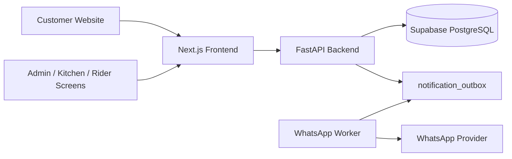

# Database Table Concept

This is the production database concept for Flavour Heaven. The database should be Supabase PostgreSQL, but Supabase should not be called directly from the customer frontend. The FastAPI backend owns authentication, authorization, validation, pricing, order status changes, notification creation, and all private data access.



## Core Design Rules

- Use `uuid` primary keys for business records.
- Store money as integer PKR, never float.
- Use `timestamptz` for all date/time columns.
- Keep price snapshots on every order item and modifier.
- Encrypt private customer fields such as phone and address.
- Store searchable hashes separately from encrypted values.
- Never store raw public tracking tokens. Store `tracking_token_hash`; keep any encrypted token only if the backend needs to reconstruct links for notifications.
- Keep the database behind FastAPI. The browser should only receive public menu data, masked tracking data, or staff data allowed by the logged-in role.
- Use audit logs for staff actions that affect orders, menu, users, payments, or security.

## Screen To Table Mapping

| Screen or workflow | Main tables used |
| --- | --- |
| Customer order type popup | `outlets`, `delivery_zones`, `business_settings` |
| Homepage banners and categories | `homepage_banners`, `media_assets`, `menu_categories`, `promotions` |
| Menu browsing | `menu_categories`, `menu_items`, `item_variants`, `modifier_groups`, `modifiers` |
| Item customization modal | `item_variants`, `menu_item_modifier_groups`, `modifiers`, `modifier_group_dependencies` |
| Checkout | `customers`, `customer_addresses`, `orders`, `order_addresses`, `order_items`, `order_item_modifiers` |
| Tracking page | `orders`, `order_status_events`, `delivery_assignments` |
| Staff login | `staff_users`, `roles`, `permissions`, `staff_user_roles`, `staff_sessions`, `security_events` |
| Admin dashboard | `orders`, `order_items`, `order_status_events`, `delivery_assignments`, `audit_logs` |
| Confirm order button | `orders`, `order_status_events`, `audit_logs`, `notification_outbox` |
| Kitchen screen | `orders`, `order_items`, `order_item_modifiers` filtered to kitchen statuses |
| Rider screen | `delivery_assignments`, `rider_locations`, `orders` |
| Menu manager | `menu_categories`, `menu_items`, `item_variants`, `modifier_groups`, `modifiers`, `media_assets` |
| WhatsApp confirmation | `notification_templates`, `notification_outbox` |

## Business And Branch Tables

### `businesses`

One row for Flavour Heaven. Keeps brand-level settings.

Important fields:
- `id`
- `name`
- `slug`
- `legal_name`
- `support_phone`
- `whatsapp_phone`
- `email`
- `timezone`
- `currency`
- `is_active`
- `created_at`
- `updated_at`

### `outlets`

One row per physical branch. Start with E-11/3 Markaz, but support more outlets later.

Important fields:
- `business_id`
- `name`
- `slug`
- `phone`
- `address_text`
- `latitude`
- `longitude`
- `opening_hours_json`
- `is_24_7`
- `delivery_enabled`
- `pickup_enabled`
- `car_hop_enabled`
- `is_active`

### `business_settings`

Flexible operational settings without adding a new column every time.

Examples:
- order cutoff rules
- preparation time defaults
- WhatsApp handoff phone
- free delivery copy
- checkout required fields

Important fields:
- `business_id`
- `outlet_id`
- `key`
- `value_json`
- `updated_by_staff_id`
- `updated_at`

## Staff Login And RBAC Tables

### `staff_users`

Real staff identities. Passwords are hashed. Phone numbers are encrypted and hashed.

Important fields:
- `business_id`
- `name`
- `email`
- `phone_hash`
- `phone_enc`
- `password_hash`
- `is_active`
- `mfa_enabled`
- `failed_login_count`
- `locked_until`
- `last_login_at`
- `deleted_at`

### `roles`

System roles:
- `OWNER`
- `SYSTEM_ADMIN`
- `MANAGER`
- `CASHIER`
- `KITCHEN`
- `RIDER`
- `MENU_EDITOR`
- `SUPPORT`

### `permissions`

Atomic backend permissions. Examples:
- `orders:view`
- `orders:update`
- `orders:cancel`
- `orders:assign_rider`
- `menu:view`
- `menu:update`
- `staff:view`
- `staff:update`
- `reports:view`
- `settings:update`

### `role_permissions`

Join table connecting roles to permissions.

### `staff_user_roles`

Connects a staff user to one or more roles, optionally scoped to one outlet.

This is how a future multi-branch setup can allow:
- one manager to see all outlets
- one cashier to see only E-11
- one rider to see only assigned deliveries

### `staff_sessions`

Refresh/session records for secure staff login.

Important fields:
- `staff_user_id`
- `refresh_token_hash`
- `ip_hash`
- `user_agent_hash`
- `expires_at`
- `revoked_at`
- `created_at`

## Menu, Options, Images, And Deals

### `media_assets`

Abstracts images so we can use Supabase Storage first and Cloudinary later without changing menu tables.

Important fields:
- `business_id`
- `provider`
- `bucket`
- `storage_key`
- `public_url`
- `alt_text`
- `width`
- `height`
- `mime_type`
- `uploaded_by_staff_id`

### `menu_categories`

Categories such as pizza, burgers, shawarma, starters, fries, drinks, deals.

Important fields:
- `business_id`
- `name`
- `slug`
- `description`
- `image_asset_id`
- `banner_asset_id`
- `display_order`
- `is_active`

### `menu_items`

Main sellable items.

Important fields:
- `business_id`
- `category_id`
- `name`
- `slug`
- `description`
- `base_price_pkr`
- `compare_at_price_pkr`
- `image_asset_id`
- `preparation_minutes`
- `tags_json`
- `is_active`
- `is_available`
- `is_featured`
- `is_popular`
- `display_order`
- `deleted_at`

Use `is_active = false` for hidden items. Use `is_available = false` for sold-out items.

### `item_variants`

Sizes/options like regular, large, party, single, double.

Important fields:
- `menu_item_id`
- `name`
- `price_pkr`
- `compare_at_price_pkr`
- `is_default`
- `is_active`
- `display_order`

### `modifier_groups`

Choice groups such as "Choose your drink", "Make it a combo", "Add ons", "Sauce choice".

Important fields:
- `business_id`
- `name`
- `selection_type`
- `min_select`
- `max_select`
- `is_required`
- `display_order`

### `modifiers`

Actual choices under modifier groups.

Examples:
- fries and drink
- cheese slice
- salsa dip
- Gourmet Cola
- extra mayo

Important fields:
- `modifier_group_id`
- `name`
- `price_delta_pkr`
- `is_active`
- `display_order`

### `menu_item_modifier_groups`

Connects menu items to their available modifier groups.

### `modifier_group_dependencies`

Supports conditional options.

Example:
- If customer selects `Fries & Drink`, then show required `Select Your Drink`.

### `homepage_banners`

Admin-managed promotional banners.

Important fields:
- `business_id`
- `outlet_id`
- `title`
- `subtitle`
- `media_asset_id`
- `target_type`
- `target_id`
- `target_url`
- `starts_at`
- `ends_at`
- `display_order`
- `is_active`

### `promotions`

Discount rules. V1 can be simple, but the table should support future codes and time windows.

Important fields:
- `business_id`
- `title`
- `code`
- `discount_type`
- `discount_value`
- `min_subtotal_pkr`
- `starts_at`
- `ends_at`
- `active_days_json`
- `active_time_window_json`
- `is_active`

## Customer, Location, And Delivery

### `customers`

Customer identity. Phone is encrypted for privacy and hashed for lookup.

Important fields:
- `name`
- `phone_e164_hash`
- `phone_e164_enc`
- `phone_last4`
- `marketing_opt_in`
- `last_order_at`

### `customer_addresses`

Saved address records when useful. Checkout also snapshots the address into `order_addresses`.

Important fields:
- `customer_id`
- `label`
- `address_enc`
- `area_text`
- `delivery_zone_id`
- `latitude`
- `longitude`
- `accuracy_meters`
- `landmark`

### `delivery_zones`

Delivery areas and fees. This is where the E-11 rule belongs.

Important fields:
- `outlet_id`
- `name`
- `area_label`
- `sector_code`
- `fee_pkr`
- `minimum_order_pkr`
- `free_delivery_min_pkr`
- `estimated_minutes`
- `polygon_geojson`
- `is_active`

Seed rule:
- E-11 zones: `fee_pkr = 0`
- Other sectors: paid delivery fee, for example `fee_pkr = 150` or whatever business confirms

The backend must recalculate delivery fee from this table. The frontend can display it, but it must not be trusted for final price.

## Orders And Checkout

### `orders`

Main order header.

Important fields:
- `business_id`
- `outlet_id`
- `customer_id`
- `reference`
- `tracking_token_hash`
- `order_type`
- `status`
- `payment_status`
- `subtotal_pkr`
- `modifier_total_pkr`
- `delivery_fee_pkr`
- `discount_pkr`
- `tax_pkr`
- `total_pkr`
- `currency`
- `delivery_zone_id`
- `customer_note`
- `internal_note`
- `source`
- `created_by_staff_id`
- `confirmed_by_staff_id`
- `confirmed_at`
- `estimated_ready_at`
- `completed_at`
- `cancelled_at`
- `cancellation_reason`

Order status flow:

```text
PENDING -> CONFIRMED -> PREPARING -> READY -> OUT_FOR_DELIVERY -> COMPLETED
```

Pickup and car-hop can skip `OUT_FOR_DELIVERY`:

```text
READY -> COMPLETED
```

Cancellation:

```text
PENDING/CONFIRMED/PREPARING/READY/OUT_FOR_DELIVERY -> CANCELLED
```

Cancellation must require a reason.

### `order_addresses`

Address snapshot for the exact order. This is needed because customer addresses can change later.

Important fields:
- `order_id`
- `address_snapshot_enc`
- `area_snapshot`
- `zone_name_snapshot`
- `latitude`
- `longitude`
- `accuracy_meters`
- `landmark`
- `delivery_fee_snapshot_pkr`

### `order_items`

Line items with item and variant price snapshots.

Important fields:
- `order_id`
- `menu_item_id`
- `variant_id`
- `category_name_snapshot`
- `item_name_snapshot`
- `variant_name_snapshot`
- `quantity`
- `unit_price_pkr_snapshot`
- `compare_at_price_pkr_snapshot`
- `line_subtotal_pkr`
- `instructions`
- `sort_order`

### `order_item_modifiers`

Selected add-ons/options with snapshot pricing.

Important fields:
- `order_item_id`
- `modifier_id`
- `group_name_snapshot`
- `modifier_name_snapshot`
- `quantity`
- `unit_price_delta_pkr_snapshot`
- `line_total_pkr`
- `is_required`

## Operations, Rider, Payment, And Notifications

### `order_status_events`

Immutable order timeline.

Important fields:
- `order_id`
- `from_status`
- `to_status`
- `changed_by_staff_id`
- `source`
- `reason`
- `note`
- `created_at`

### `delivery_assignments`

Connects an order to a rider.

Important fields:
- `order_id`
- `rider_staff_id`
- `assigned_by_staff_id`
- `status`
- `assigned_at`
- `picked_up_at`
- `delivered_at`
- `failed_at`
- `proof_note`

### `rider_locations`

GPS pings from rider device, only after staff/rider login and with permission.

Important fields:
- `rider_staff_id`
- `order_id`
- `latitude`
- `longitude`
- `accuracy_meters`
- `recorded_at`

### `order_payments`

Cash/manual in v1, ready for JazzCash, EasyPaisa, or card later.

Important fields:
- `order_id`
- `method`
- `amount_pkr`
- `status`
- `received_by_staff_id`
- `provider_reference`
- `received_at`

### `notification_templates`

Template definitions for WhatsApp/SMS/email.

Important fields:
- `business_id`
- `channel`
- `template_code`
- `provider_template_name`
- `language`
- `body_preview`
- `is_active`

### `notification_outbox`

Reliable queue for WhatsApp messages. Staff confirmation should create an outbox row; a worker sends it.

Important fields:
- `business_id`
- `order_id`
- `channel`
- `template_code`
- `recipient_hash`
- `payload_json`
- `status`
- `attempt_count`
- `next_attempt_at`
- `provider_message_id`
- `last_error`
- `locked_at`

## Security, Audit, And Reliability

### `audit_logs`

Staff action history.

Examples:
- order confirmed
- order cancelled
- rider assigned
- price changed
- item marked sold out
- staff role changed

Important fields:
- `actor_staff_id`
- `actor_role_code`
- `action`
- `entity_type`
- `entity_id`
- `ip_hash`
- `user_agent_hash`
- `metadata_json`
- `created_at`

### `security_events`

Authentication and suspicious activity events.

Examples:
- failed login
- locked account
- invalid tracking token
- forbidden role access
- repeated idempotency conflict

Important fields:
- `staff_user_id`
- `customer_hash`
- `event_type`
- `severity`
- `ip_hash`
- `user_agent_hash`
- `metadata_json`
- `created_at`

### `idempotency_keys`

Prevents double order creation if customer refreshes or retries checkout.

Important fields:
- `key_hash`
- `scope`
- `request_hash`
- `response_json`
- `status`
- `expires_at`
- `created_at`

Use this for:
- public order creation
- staff order confirmation
- payment recording
- WhatsApp outbox worker retries

## Important Indexes

Required indexes:
- `orders(reference)` unique
- `orders(tracking_token_hash)` unique
- `orders(outlet_id, status, created_at)`
- `orders(customer_id, created_at)`
- `order_status_events(order_id, created_at)`
- `notification_outbox(status, next_attempt_at)`
- `delivery_assignments(rider_staff_id, status)`
- `rider_locations(order_id, recorded_at)`
- `menu_items(category_id, display_order)`
- `menu_items(business_id, is_active, is_available)`
- `delivery_zones(outlet_id, sector_code)` unique
- `staff_users(email)` unique
- `staff_sessions(refresh_token_hash)` unique
- `audit_logs(entity_type, entity_id)`
- `security_events(event_type, created_at)`

## Role Access Concept

The backend should enforce this every time, not only in the UI.

| Role | Allowed access |
| --- | --- |
| `OWNER` | Everything, including reports, staff, settings |
| `SYSTEM_ADMIN` | Technical/system access, migrations/support tools |
| `MANAGER` | Orders, menu, riders, reports, most settings |
| `CASHIER` | View/create/confirm/cancel orders, assign riders |
| `KITCHEN` | View confirmed/preparing/ready orders, move prep statuses only |
| `RIDER` | View assigned delivery orders only, update delivery progress |
| `MENU_EDITOR` | Manage menu, images, categories, sold-out status |
| `SUPPORT` | View limited order/customer support data, no price/security changes |

## Confirm Order Transaction

When staff clicks "Confirm Order", FastAPI should run one database transaction:

1. Verify staff has `orders:update`.
2. Lock the order row.
3. Verify current status is `PENDING`.
4. Update `orders.status = CONFIRMED`.
5. Set `confirmed_by_staff_id`.
6. Set `confirmed_at`.
7. Insert `order_status_events`.
8. Insert `audit_logs`.
9. Insert `notification_outbox` with WhatsApp confirmation payload.
10. Return updated order details to the admin dashboard.

The WhatsApp send itself should happen asynchronously. If WhatsApp is slow or fails, the order must still remain confirmed and the outbox row should retry.

## Supabase Security Notes

Recommended production stance:

- Do not expose Supabase anon keys for direct order/admin database access.
- Keep Supabase service role key only in backend/server environment.
- Enable RLS if we later add direct Supabase clients, but for v1 the backend should be the gatekeeper.
- Store encryption keys outside the database.
- Use Supabase backups.
- Use separate environments: local, staging, production.
- Never run destructive migrations directly on production without a backup and staging test.

## Migration Order For Supabase MCP

When Supabase MCP is connected, use this order:

1. Inspect existing project tables first.
2. Confirm project is empty or safe to migrate.
3. Create enums.
4. Create business/outlet/RBAC tables.
5. Create media/menu tables.
6. Create customer/delivery tables.
7. Create orders and order snapshot tables.
8. Create operations/payment/notification tables.
9. Create audit/security/idempotency tables.
10. Add indexes and unique constraints.
11. Seed Flavour Heaven business, E-11 outlet, roles, permissions, delivery zones, and sample menu.
12. Run backend smoke tests.

## Seed Data Needed First

Minimum seed:

- Business: Flavour Heaven
- Outlet: E-11/3 Markaz
- Delivery zones:
  - E-11/1, E-11/2, E-11/3, E-11/4 with `fee_pkr = 0`
  - other sectors with paid fees after business confirmation
- Roles and permissions
- Demo owner, cashier, kitchen, rider users for development only
- Categories from the menu screenshots
- Menu items from the provided menu
- Basic homepage banners using placeholder URLs until real images are provided
- WhatsApp template placeholder `order_confirmed_v1`

## Final Architecture Decision

Use Supabase PostgreSQL as the production database and FastAPI as the production backend. This gives the cafe:

- a managed database
- a real backend security boundary
- role-secured admin/kitchen/rider screens
- reliable order history
- audit logs
- future WhatsApp API support
- future payment support
- future multi-branch support

